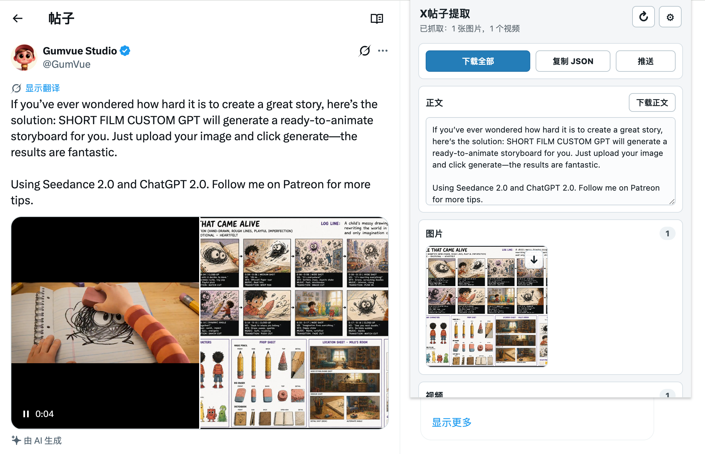

# X帖子提取

Chrome extension for extracting text, images, and videos from X post detail pages.

## Preview



## Install

1. Open `chrome://extensions`.
2. Enable Developer mode.
3. Click Load unpacked.
4. Select this directory.

## Use

1. Open a post URL such as `https://x.com/rovvmut_/status/2050449913323078059`.
2. Click the extension icon.
3. Click the refresh button if the post is still loading.
4. Copy the extracted JSON, download the post text, download all assets, or click push.
5. Use the download button on image and video cards to save media directly through Chrome downloads.

`Download all` saves `text.txt`, `meta.json`, and all downloadable image/video files into the same `x-post-extract/{statusId}/` directory.

Downloads use `saveAs: false`, so the extension does not ask for a save location by default. If Chrome still opens a save dialog, disable `Ask where to save each file before downloading` in `chrome://settings/downloads`.

## Configure Push

Open the extension options page from the gear button in the popup, then set:

- `Push endpoint`: the service URL that receives extracted payloads.
- `Token`: optional bearer token for that service.

## Payload

```json
{
  "source": "x",
  "url": "https://x.com/user/status/123",
  "statusId": "123",
  "author": {
    "displayName": "Name",
    "handle": "@handle"
  },
  "text": "post text",
  "images": [
    {
      "url": "https://pbs.twimg.com/media/...",
      "alt": "",
      "width": 1200,
      "height": 800
    }
  ],
  "videos": [
    {
      "url": "https://video.twimg.com/ext_tw_video/...",
      "posterUrl": "https://pbs.twimg.com/ext_tw_video_thumb/...",
      "width": 1280,
      "height": 720,
      "duration": 12.34,
      "sourceKind": "mp4"
    }
  ],
  "extractedAt": "2026-05-03T00:00:00.000Z"
}
```

Video `url` may be empty when X only exposes a `blob:` player source and the real `video.twimg.com` stream has not loaded yet. In that case the payload still includes `posterUrl` when available.

## Push API

The extension sends `POST` requests to the configured endpoint with the payload above as JSON.
If a token is configured, it is sent as:

```http
Authorization: Bearer <token>
```

---
[catchmeta.com](catchmeta.com) — curated, ready-to-use AI prompts for common generation tasks